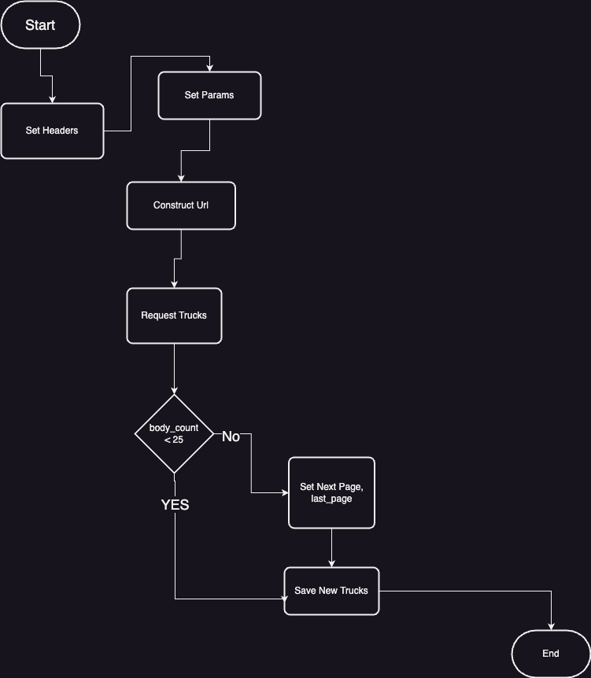
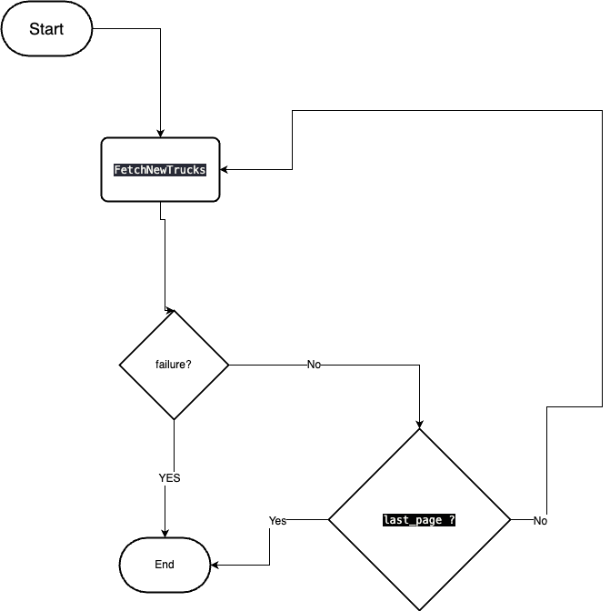

# Transportation Management System #
This backend is the foundation for the Transportation Management System (TMS), which is a software system that helps manage transportation operations for businesses. This system handles drivers , trucks , assign truck to driver

## Technologies Used ##
This backend uses the following technologies:

Ruby on Rails 7.0.5
Postgresql 12.1
Redis
JWT 
Docker
Docker compose 
Sidekiq


## How to run ##
1. build the solution 
```
docker compose build
```
2. Configure the environment variables in the `.env` file:
```
DATABASE_HOST=db
DATABASE_USER=postgres
DATABASE_PASSWORD=postgres12
DATABASE_NAME=t_m_s_development
TRUCK_API_KEY=illa-trucks-2023
TRUCK_API_URL=https://task-api-8etf.onrender.com/api/v1/trucks
JWT_SECRET=KFkVR9B04NrydlZC7ananZJwFBCNv52M
REDIS_HOST=redis
SIDEKIQ_DASHBOARD_USERNAME=admin
SIDEKIQ_DASHBOARD_PASSWORD=dummy
```
3. Start the solution:
```
docker compose up
```
4. Access the APIs through http://localhost:3000/

> Note: you can find postman collection

## Architecture ##

## Class Diagram ##


## Flow Charts ##
- Fetch New Trucks Service



- Fetch Trucks Worker


## Testing ##
- Unit Testing
- Integration Testing
- E2E Testing (API Testing)